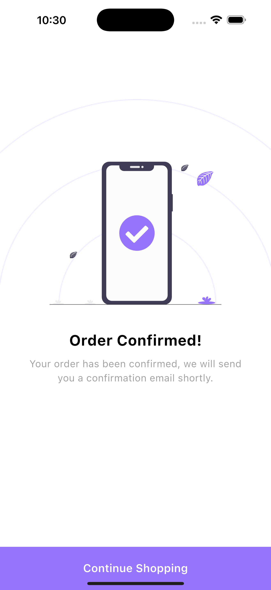

# E-Commerce App

## 🚀 Overview

This is a sleek **e-commerce app** where users can:

- Browse products 🛍️
- View product details 🔍
- Add items to the cart 🛒
- Place orders ✅
- Edit products ✏️

The app ensures a smooth user experience with **local cart management**, **product pagination**, and an efficient checkout process.

---

## 🛠️ Tech Stack

- **Flutter** (for cross-platform mobile development)
- **Dart** (programming language)
- **Hive / Isar** (local storage for cart management)
- **BloC** (state management)

---

## 📌 Features

### 🌟 Core Functionality

- **Product Browsing**: View a list of products with pagination for better performance.
- **Product Details**: Get detailed information about each product.
- **Cart Management**: Add, update, and remove items from the cart using Hive/Isar.
- **Order Placement**: Seamlessly place orders with a streamlined checkout process.
- **Edit Products**: Modify product details **without reloading the entire page**.

### 📲 Cross-Platform Support

- Works on **both Android & iOS**.

---

## 📦 Installation

1. **Clone the Repository**
   ```sh
   git clone https://github.com/your-repo/ecommerce-app.git
   cd ecommerce-app
   ```
2. **Install Dependencies**
   ```sh
   flutter pub get
   ```
3. **Run the App**
   ```sh
   flutter run
   ```

---

## 📚 Folder Structure


## ⚡ State Management (BloC)

State management is handled using **Bloc** for:

- **Product Listing** (with Pagination)
- **Cart Management** (Local Storage with Hive/Isar)
- **Order Placement**
- **Product Editing** (Updating a single item efficiently)

---


## 📌 API Integration

- The app fetches products via an **API with pagination**.
- Editing a product updates only the specific item **without reloading the full list**.

---

## 📸 Screenshots

### Home Screen


### Product Details Screen

### Product Added Screen

### Cart Screen

### Submit Screen

---

## 🤝 Contribution

Feel free to contribute by following these steps:

1. Fork the repo
2. Create a new branch (`feature/your-feature`)
3. Commit your changes
4. Push to your branch
5. Create a pull request 🚀

---

## 📜 License

This project is licensed under the **MIT License**.

---

## 💬 Support

For any issues, reach out via GitHub Issues.

---

### 🎉 Happy Coding! 🚀

